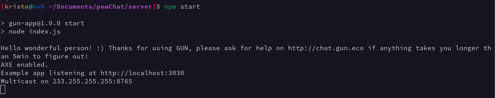
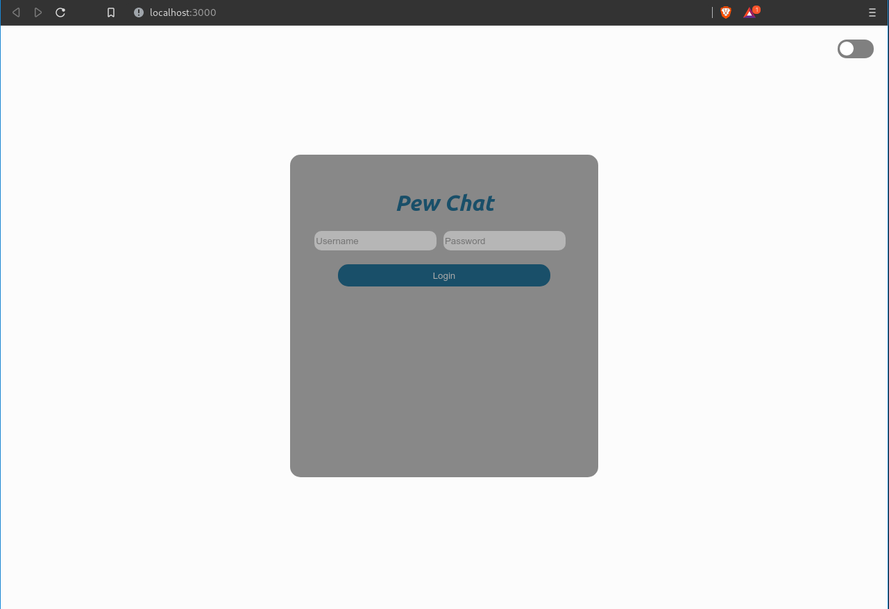
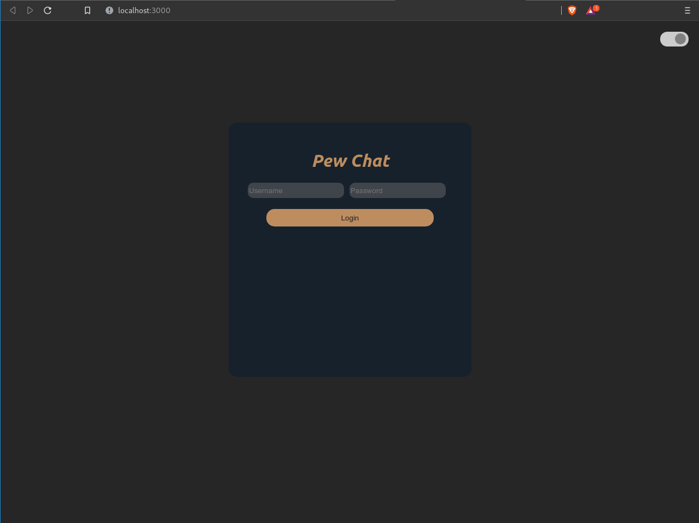
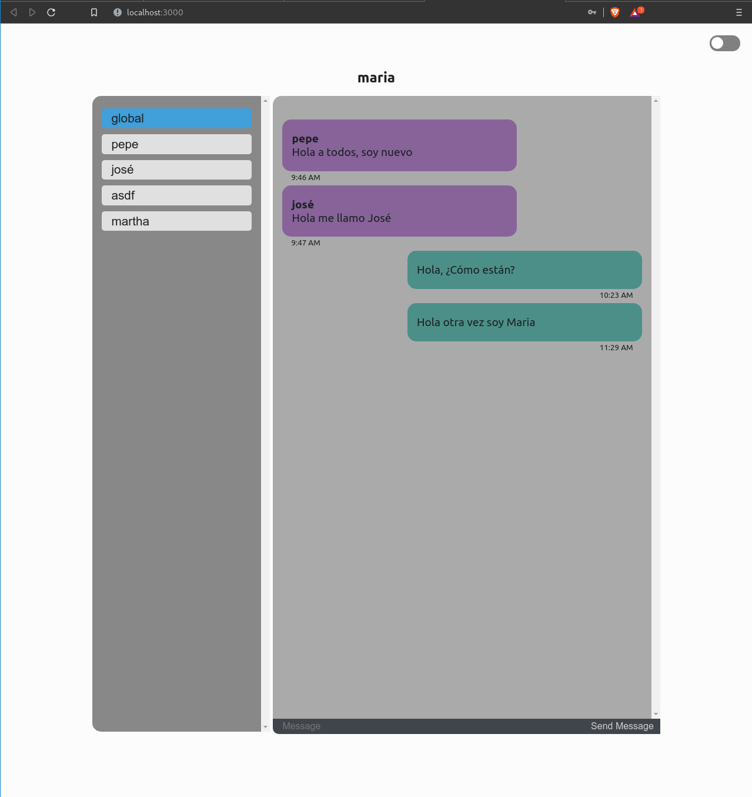
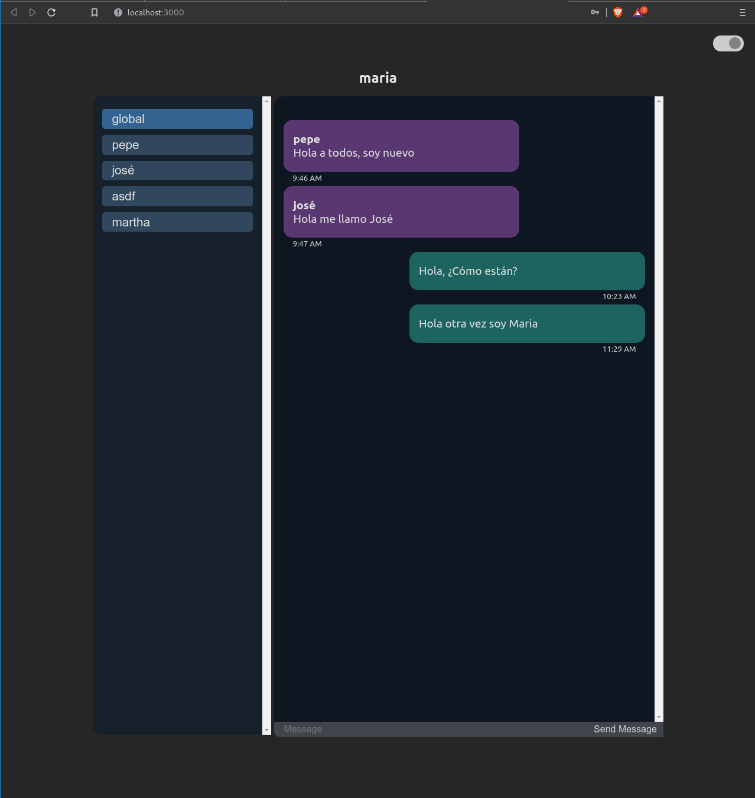

<div align="center">
  <h1>Pew Chat</h1>
  </img>
  <h4>Aplicación de mensajería descentralizada basada en P2P (<i>peer-to-peer</i>) sencilla, segura, modular y escalable</h4>
  <br>
</div>

<div>
  <h2>Requerimientos</h2>
  <ul>
    <li><a href="https://nodejs.org/es/" rel="external">NodeJS</a></li>
    <li><a href="https://es.reactjs.org/" rel="external">ReactJS</a></li>
    <li><a href="https://expressjs.com/" rel="external">Express</a></li>
    <li><a href="https://gun.eco/" rel="external">Gun</a></li>
    <li><a href="https://github.com/brix/crypto-js" rel="external">Crypto-js</a></li>
    <li><a href="https://momentjs.com/" rel="external">Moment</a></li>
  </ul>
  
  <h2>Instalación</h2>
  
  ```bash
  # Clona el repositorio en el directorio actual
  git clone https://github.com/programadoresJocosos/pewChat
  
  # Accedemos al directorio donde se encuentra el proyecto
  cd pewChat
  
  # Instalamos las dependencias de app y de server
  npm install ./app && npm install ./server
  ```
  
  <h2>Uso</h2>
  <p>Para comenzar, primero debemos de inicializar el "server" que nos permitirá encontrar otros peers para posteriormente comunicarnos directamente con ellos, para ello debemos  de ejecutar los siguientes comandos en una terminal del sistema (y mantenerla abierta durante la ejecución).</p>
  
  ```bash
  # Nos situamos en la carpeta del "server"
  cd server
  # Para ejecutar el "server" desde una terminal individual
  npm start
  ```
  
  <p>Una vez que el "server" se ha incializado podremos escuchar a otros peers en la red, obteniendo los siguientes resultados en la terminal.</p>
  </img>
  <p>Por lo que ahora solo basta ejecutar nuestra aplicación en otra terminal con el uso de los siguientes comandos para  poder comunicarnos con otros peers.</p>
  
  ```bash
  # Nos situamos en la carpeta de la app
  cd app
  # Para ejecutar la app desde una terminal distinta
  npm start
  ```
  
  <p>Una vez que la aplicación ha inicializado correctamente se muestran los siguientes datos en pantalla.</p>
  </img>
  
  <p>Una vez que la aplicación ha inicializado correctamente se muestran los siguientes datos en la terminal y se abrirá una ventana en el navegador desde el cual podremos comenzar a utilizar la aplicación.</p>
  </img>
  
  <h2>Capturas de ejecución</h2>
  </img>
  </img>
  </img>
  </img>
</div>
